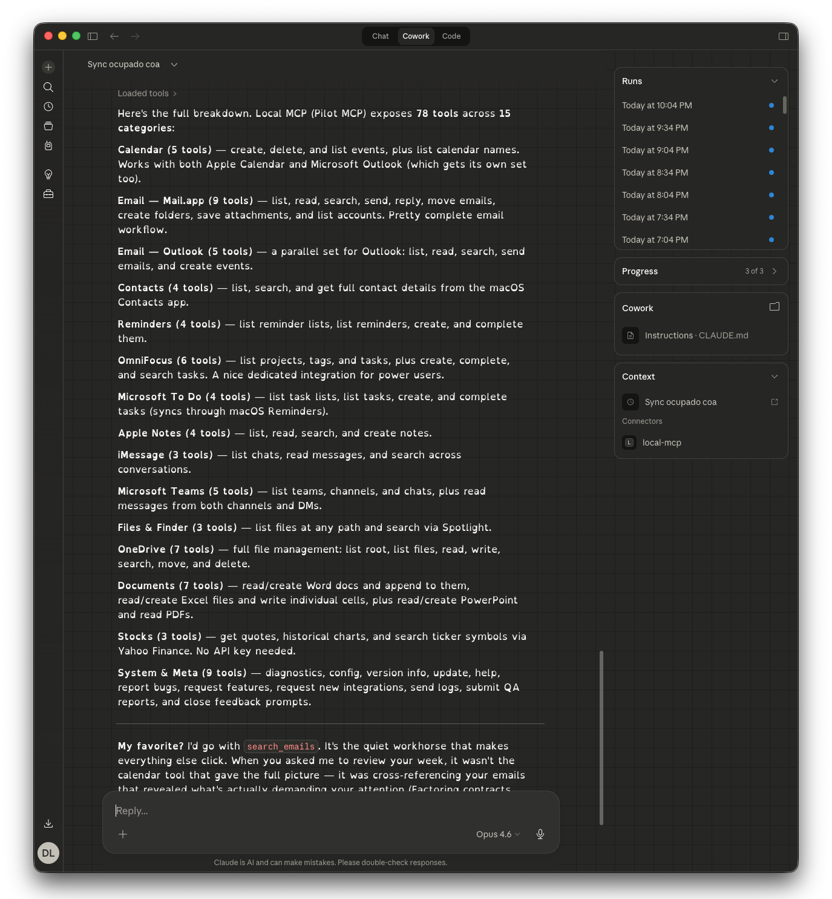
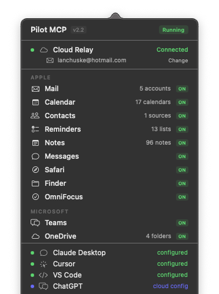

# LMCP — Give Your AI Native Access to Your Apps

[](https://www.npmjs.com/package/local-mcp)
[](https://local-mcp.com)
[](https://local-mcp.com/en/privacy)
[](https://smithery.ai/server/@lanchuske/local-mcp)

**LMCP connects your AI assistant to Mail, Calendar, Contacts, Microsoft Teams, Slack, WhatsApp, OneDrive, Notes, Reminders, OmniFocus, and more — 138 tools, all running locally on your Mac. No cloud. No API keys. No OAuth. Your data never leaves your machine.**

```bash
curl -fsSL 'https://local-mcp.com/install?ref=github' | bash
```

> Installs in 2 minutes. Auto-configures Claude Desktop, Claude Code, Cursor, Windsurf, VS Code, and Zed. **Free — no paid tier yet.**

⭐ **Like it? [Star this repo](https://github.com/lanchuske/local-mcp-releases)** — it helps others discover LMCP.

<p align="center">
  
</p>
<p align="center"><em>Native tools across 18 categories — Mail, Calendar, Teams, Slack, WhatsApp, OneDrive, Notes, OmniFocus, and more</em></p>

<details>
<summary>Menu bar app</summary>
<p align="center">
  
</p>
<p align="center"><em>Status at a glance — all your Mac apps connected</em></p>
</details>

---

## What your AI can do

| App | What you can ask |
|-----|-----------------|
| **Mail** | "Summarize my unread emails" · "Reply to Jana saying I'll be 10 minutes late" · "Find emails from the contracts team last week" |
| **Calendar** | "What do I have tomorrow?" · "Schedule a team sync Friday at 3pm" · "Cancel my 2pm meeting" |
| **Contacts** | "Get Jana's phone number" · "Find everyone at Acme Corp" |
| **Microsoft Teams** | "What did the engineering channel say today?" · "Show my last conversation with Marco" |
| **Slack** | "Summarize #engineering from today" · "What did Ana say in the #design channel?" |
| **WhatsApp** | "Summarize my WhatsApp from this morning" · "Find the chat with Carla about the trip" *(via the unofficial Wacli client — requires QR-code sign-in)* |
| **OneDrive** | "Find the Q1 report" · "Upload this summary to the shared folder" |
| **Outlook** | "Read my Outlook inbox" · "Search for invoices from last month" |
| **Reminders** | "Add a reminder to call the bank tomorrow at 9am" · "What's on my list?" |
| **OmniFocus** | "Show my overdue tasks" · "Create a task to review the contract" |
| **Notes** | "Search my notes for the API keys" · "Create a note with today's decisions" |
| **Messages** | "What did Ana send me this morning?" · "Search iMessages for the address" |
| **Word / Excel / PPT** | "Read this contract" · "Create a spreadsheet with these numbers" |
| **PDF** | "Summarize this PDF" |
| **Finder** | "Find all files named 'invoice' on my Mac" |
| **Safari** | "List my bookmarks in the Dev folder" |
| **Stocks** | "How is AAPL doing today?" · "Show me a chart of MSFT this month" |
| **NordVPN** | "Is my VPN connected?" · "Recommend a server in Japan" |

138 tools total. Read operations run instantly. Write operations (send email, delete event) show a preview and require confirmation.

---

## Install

```bash
curl -fsSL 'https://local-mcp.com/install?ref=github' | bash
```

Auto-detects and configures: **Claude Desktop · Claude Code · Cursor · Windsurf · VS Code · Zed**

Restart your AI client once. That's it.

### Prefer not to use the terminal?

You don't need the command line. Two one-click options:

- **Claude Desktop users** → download the one-click extension at **[local-mcp.com/install/mcpb](https://local-mcp.com/install/mcpb)** and double-click it. No terminal, no config.
- **Everyone else** → get the Mac app from **[local-mcp.com](https://local-mcp.com)**, drag it to Applications, and open it. The menu-bar app walks you through connecting ChatGPT, Claude.ai, or Grok — no setup files to edit.

**Requirements:** macOS 12+ (Monterey or later, Apple Silicon or Intel). Windows & Linux are on the waitlist at [local-mcp.com](https://local-mcp.com).

## Use with ChatGPT (web)

ChatGPT can call your Mac apps through LMCP's Cloud Relay. The full walkthrough with
screenshots is at **[local-mcp.com/guides/chatgpt-mac](https://local-mcp.com/guides/chatgpt-mac)** —
the short version:

1. **Install LMCP** (above) and open the menu bar app → **Settings → Connect**. Enter your
   email, click **Connect**, then toggle **Cloud Data Forwarding** ON.
2. On **[chatgpt.com](https://chatgpt.com)** (web only — Plus/Pro/Business/Enterprise/Edu):
   **Settings → Apps & Connectors → Advanced settings → enable Developer mode**.
3. **Apps & Connectors → Create**: Name `LMCP`, URL `https://www.local-mcp.com/mcp`,
   Authentication **OAuth**.
4. On the **Authorize ChatGPT** page, paste your token (**Settings → Connect → Copy** next to
   **Token**) and click **Authorize**. The token is your secure per-machine credential — no email step.
5. New chat → **+ → More → LMCP**, then ask *"Summarize my unread emails."*

> Using **Claude Desktop, Cursor, VS Code, Windsurf, or Zed**? Skip all of this — `curl … | bash`
> auto-configures them locally and nothing leaves your Mac.

---

## How it works

```
┌─────────────────────────────────┐
│  Claude · Cursor · VS Code · …  │
└───────────┬─────────────────────┘
            │  MCP protocol (stdio)
┌───────────▼─────────────────────┐
│        LMCP server          │
│  JXA · EventKit · AppleScript   │
│  LevelDB · native macOS APIs    │
└───────────┬─────────────────────┘
            │
┌───────────▼─────────────────────┐
│  Mail · Calendar · Teams · …     │
│  Your Mac apps (local data)      │
└─────────────────────────────────┘
```

### Why native?

Most MCP servers call cloud APIs. LMCP talks directly to macOS frameworks:

- **EventKit** for Calendar — reads all providers (iCloud, Google, Exchange)
- **AppleScript/JXA** for Mail — works with any IMAP account
- **LevelDB** for Teams — reads the local IndexedDB cache, no Graph API needed
- **CNContactStore** for Contacts — native framework, no app launch required
- **File system** for OneDrive, Word, Excel, PowerPoint

This means: **no API keys, no OAuth, no rate limits, works offline, sub-second responses.**

### Microsoft Teams without Graph API

The most technically interesting part: Teams messages are read directly from the local LevelDB cache at:

```
~/Library/Containers/com.microsoft.teams2/.../IndexedDB/https_teams.microsoft.com_0.indexeddb.leveldb
```

No Azure AD registration, no tenant admin approval, no OAuth tokens. Just the messages already cached on your Mac.

### Cloud Relay (optional)

Claude.ai and ChatGPT can't reach localhost. Enable Cloud Relay in the menu bar app — a secure WebSocket tunnel routes requests to your local server. Your data is encrypted in transit and never stored.

---

## Comparison with alternatives

| Feature | **LMCP** | apple-mcp | Composio | MS 365 Connector |
|---------|:---:|:---:|:---:|:---:|
| **Runs locally** | ✅ | ✅ | ❌ Cloud | ❌ Cloud |
| **API keys needed** | ❌ None | ❌ None | ✅ Required | ✅ Azure AD |
| **Setup time** | ~2 min | ~10 min | ~15 min | ~30 min |
| **Total tools** | 138 | ~20 | Varies | ~15 |
| **Microsoft Teams** | ✅ Local cache | ❌ | Via Graph API | Via Graph API |
| **OneDrive** | ✅ Full CRUD | ❌ | Via Graph API | Via Graph API |
| **Calendar** | ✅ CRUD | ❌ | Via API | Via Graph API |
| **Email** | ✅ Full | ❌ | Via API | Via Graph API |
| **Office docs** | ✅ Create/Read | ❌ | Limited | ❌ |
| **Notes & Reminders** | ✅ | ✅ | ❌ | ❌ |
| **OmniFocus** | ✅ | ❌ | ❌ | ❌ |
| **iMessage** | ✅ Read | ❌ | ❌ | ❌ |
| **Data privacy** | 100% local | 100% local | Cloud | Cloud |
| **Price** | Free | Free (OSS) | Freemium | Free (M365) |
| **Platform** | macOS (Windows · Linux waitlist) | macOS | Cross-platform | Cross-platform |

> Looking for an [Apple MCP server alternative](https://local-mcp.com/guides/apple-mcp-server-alternative)? LMCP is the zero-config, signed-app option that also covers Teams, Slack and WhatsApp.

---

## Popular guides

The things people most often want their AI to reach — and the ones cloud connectors can't:

- **[Read your iMessages](https://local-mcp.com/guides/claude-imessage-mac)** — the only MCP server that does it (iMessage has no API; LMCP reads the local database on-device)
- **[One server for Mail, iMessage & Teams](https://local-mcp.com/guides/mcp-server-mail-imessage-teams)** — yes, a single MCP server does all three, locally
- **[Microsoft Teams without Graph API](https://local-mcp.com/guides/claude-teams-no-api)** — reads the local Teams cache, no Azure AD or admin consent
- **[WhatsApp on Mac](https://local-mcp.com/guides/claude-whatsapp-mac)** — connect your AI to personal WhatsApp (no Business API)
- **[Connect ChatGPT to your Mac](https://local-mcp.com/guides/chatgpt-mac)** · **[Give Claude your email](https://local-mcp.com/guides/claude-email-mac)** · **[Best MCP server for Mac](https://local-mcp.com/guides/best-mcp-server-mac)**

See all guides at **[local-mcp.com/guides](https://local-mcp.com/guides)**.

---

## Privacy & security

- All data stays on your Mac — nothing is sent to external servers
- No API keys, OAuth tokens, or cloud accounts required
- Uses standard macOS TCC permissions (the same "Allow access?" prompts any app uses)
- Calendar, Contacts, and Reminders access can be revoked anytime in System Settings
- GDPR and CCPA compliant **by architecture** — there is no cloud component to process your data
- Destructive operations always show a preview and require explicit confirmation

---

## Supported AI clients

| Client | Transport | Auto-configured |
|--------|-----------|:---:|
| Claude Desktop | stdio | ✅ |
| Claude Code | stdio | ✅ |
| Cursor | stdio | ✅ |
| Windsurf | stdio | ✅ |
| VS Code (Copilot / Cline) | stdio | ✅ |
| Zed | stdio | ✅ |
| Claude.ai | Cloud Relay | Manual |
| ChatGPT | Cloud Relay | Manual |
| Grok | Cloud Relay | Manual |

---

## Common questions

**Does LMCP send my data to the cloud?**
No. The tools run on your own machine and read directly from your installed apps. There is no cloud processing and LMCP's servers never store your data. The optional Cloud Relay is an encrypted tunnel that lets a cloud AI (ChatGPT, Claude.ai, Grok) trigger a tool on your machine — the result is produced locally and the backend doesn't persist tool responses.

**Can ChatGPT, Claude, or Cursor read my email, calendar, or Teams without API keys or OAuth?**
Yes. LMCP exposes them as MCP tools that read your local apps directly — no Microsoft Graph tokens, no Google API keys, no OAuth setup for the data.

**How is this different from Zapier, Make, or n8n?**
Those route your data through their cloud. LMCP runs the tools on your computer and returns results straight to your AI, so nothing transits a third-party cloud. Choose LMCP when privacy and local-first matter; choose a cloud automation platform when you want hosted multi-step workflows.

**How is it different from Composio or a Microsoft 365 / Graph connector?**
Those authenticate against vendor cloud APIs (OAuth tokens, tenant-admin consent). LMCP reads the apps already on your machine — Mail, the local Teams/Slack cache, synced OneDrive — with no API keys and no admin approval for the data.

**Can it read Microsoft Teams or Slack without the Graph API or admin tokens?**
Yes. It reads the Teams and Slack data already cached locally on your machine.

**Can my AI read and write local Excel, Word, PowerPoint, or PDF files?**
Yes — it reads and creates Office documents and reads PDFs locally, without uploading them anywhere.

**Does it work on Windows?**
Not yet — LMCP is macOS-only today. Windows & Linux are on the waitlist at [local-mcp.com](https://local-mcp.com).

**How much does it cost?**
Free, no paid tier yet — a permanent license, not a 14-day trial, no subscription.

---

## Roadmap

**Shipped:**

- [x] **Cloud connectors** — ChatGPT, Claude.ai, Grok via the encrypted relay
- [x] **Slack** — read channels, DMs, search
- [x] **WhatsApp** — read & send (local client)
- [x] **Microsoft Teams** — read **and** send messages
- [x] **ChatGPT** support via Cloud Relay
- [x] Guides in 12 languages

**In progress / planned:**

- [ ] Telegram
- [ ] Obsidian — read & search local vaults
- [ ] Google Drive (local sync folder)
- [ ] Persistent AI memory across sessions

Have a feature in mind? Run `request_feature` from any AI client, or [open an issue](https://github.com/lanchuske/local-mcp-releases/issues).

---

## Uninstall

Run this in Terminal to completely remove LMCP:

```bash
curl -fsSL 'https://local-mcp.com/uninstall' | bash
```

This stops all background processes, removes the auto-start LaunchAgent, deletes the app and binaries, and cleans up the MCP entries from Claude Desktop, Cursor, and other AI clients. Your emails, calendar, and other data are never stored by LMCP and remain untouched.

---

## Support

- **In your AI client:** ask Claude to run `report_bug` or `request_feature`
- **GitHub:** [open an issue](https://github.com/lanchuske/local-mcp-releases/issues)
- **Email:** [ctpo@colibird.co](mailto:ctpo@colibird.co)
- **Website:** [local-mcp.com](https://local-mcp.com?ref=github)

---

## License

LMCP is proprietary software. Free — permanent license, no expiration. See [LICENSE](LICENSE) for details.

---

⭐ **If LMCP saves you time, [star the repo](https://github.com/lanchuske/local-mcp-releases)** — it's the best way to help others discover it.

## 📬 Stay Updated

Get notified about new tools, bug fixes and major releases — no spam.

**[Subscribe to release notes →](https://local-mcp.com/#newsletter)**
