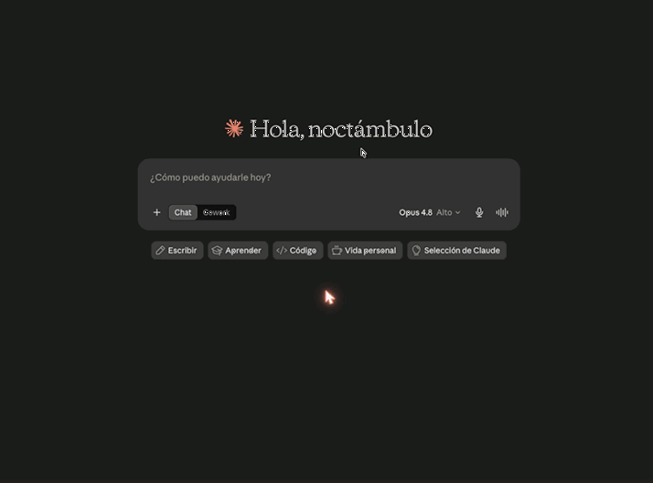

# LMCP — Give Your AI Native Access to Your Apps

[](https://www.npmjs.com/package/local-mcp)
[](https://local-mcp.com)
[](https://local-mcp.com/en/privacy)
[](https://smithery.ai/server/@lanchuske/local-mcp)

**Let your AI actually use your Mac.** Ask ChatGPT, Claude or Cursor to read & reply to your email, manage your calendar, text over iMessage, find your files, and pull data from PDFs — it just does it. It even reaches iMessage and your local apps that the web AIs can't. Tools run **on-device** — for desktop AIs nothing leaves your Mac; an optional, opt-in encrypted relay lets web AIs reach it. No API keys, free.

```bash
curl -fsSL 'https://local-mcp.com/install?ref=github-releases' | bash
```

> Installs in 2 minutes. Auto-configures Claude Desktop, Claude Code, Cursor, Windsurf, VS Code, and Zed. **Free — no paid tier yet.**

⭐ **Like it? [Star this repo](https://github.com/lanchuske/local-mcp-releases)** — it helps others discover LMCP.

<p align="center">
  
</p>
<p align="center"><em>Real recording — Claude.ai (web) using a Mac's apps through LMCP's Cloud Relay: ask → tools run → you approve → done. Captured with LMCP's own screen-capture tools.</em></p>

<p align="center">
  
</p>
<p align="center"><em>Native tools across 20 categories — Mail, Calendar, Teams, Slack, WhatsApp, OneDrive, Microsoft 365, Notes, OmniFocus, ServiceNow, and more</em></p>

<details>
<summary>Menu bar app</summary>
<p align="center">
  
</p>
<p align="center"><em>Status at a glance — all your Mac apps connected</em></p>
</details>

---

## What your AI can do

| App | What you can ask |
|-----|-----------------|
| **Mail** | "Summarize my unread emails" · "Reply to Jana saying I'll be 10 minutes late" · "Find emails from the contracts team last week" |
| **Calendar** | "What do I have tomorrow?" · "Schedule a team sync Friday at 3pm" · "Cancel my 2pm meeting" |
| **Contacts** | "Get Jana's phone number" · "Find everyone at Acme Corp" |
| **Microsoft Teams** | "What did the engineering channel say today?" · "Show my last conversation with Marco" |
| **Slack** | "Summarize #engineering from today" · "What did Ana say in the #design channel?" |
| **WhatsApp** | "Summarize my WhatsApp from this morning" · "Find the chat with Carla about the trip" *(via the unofficial Wacli client — requires QR-code sign-in)* |
| **OneDrive** | "Find the Q1 report" · "Upload this summary to the shared folder" |
| **Google Drive** | "Find the budget sheet in Drive" · "Read the project notes from My Drive" |
| **Zoom** | "Summarize my last meeting" · "What did we agree on in the kickoff call?" |
| **Outlook** | "Read my Outlook inbox" · "Search for invoices from last month" |
| **Microsoft 365** | "Read my Outlook.com inbox" · "Find Sara in the company directory" · "Add a Graph calendar event" |
| **Reminders** | "Add a reminder to call the bank tomorrow at 9am" · "What's on my list?" |
| **To Do** | "Add milk to my shopping list" · "What's due today in To Do?" |
| **OmniFocus** | "Show my overdue tasks" · "Create a task to review the contract" |
| **Notes** | "Search my notes for the API keys" · "Create a note with today's decisions" |
| **Messages** | "What did Ana send me this morning?" · "Search iMessages for the address" |
| **Word / Excel / PPT** | "Read this contract" · "Create a spreadsheet with these numbers" |
| **PDF** | "Summarize this PDF" |
| **Finder** | "Find all files named 'invoice' on my Mac" |
| **Safari** | "List my bookmarks in the Dev folder" |
| **Stocks** | "How is AAPL doing today?" · "Show me a chart of MSFT this month" |
| **ServiceNow** | "Show my open incidents" · "Create a P2 for the outage" · "Search the KB for VPN setup" |
| **Signal** | "Read my Signal chats" · "Search Signal for the address Maria sent" *(read-only, local database)* |
| **Notion** | "Search my workspace for the launch plan" · "Read the roadmap database" |
| **Any website** | "Log in to the supplier portal and download this month's invoices" · "Check this product's price every morning" *(13-tool web-automation engine, persistent sessions)* |
| **NordVPN** | "Is my VPN connected?" · "Recommend a server in Japan" |

260 tools across 22 app categories. Read operations run instantly. Write operations (send email, delete event) show a preview and require confirmation.

---

## Install

```bash
curl -fsSL 'https://local-mcp.com/install?ref=github-releases' | bash
```

Auto-detects and configures: **Claude Desktop · Claude Code · Cursor · Windsurf · VS Code · Zed**

Restart your AI client once. That's it.

### Prefer not to use the terminal?

You don't need the command line. Get the Mac app from **[local-mcp.com](https://local-mcp.com)**, drag it to Applications, and open it. The menu-bar app walks you through connecting Claude Desktop, ChatGPT, Claude.ai, or Grok — no setup files to edit. (The terminal install above also auto-configures Claude Desktop, Cursor, VS Code, and more.)

**Requirements:** macOS 13+ (Ventura or later, Apple Silicon or Intel). Windows & Linux are on the waitlist at [local-mcp.com](https://local-mcp.com).

## Use with ChatGPT (web)

ChatGPT can call your Mac apps through LMCP's Cloud Relay. The full walkthrough with
screenshots is at **[local-mcp.com/guides/chatgpt-mac](https://local-mcp.com/guides/chatgpt-mac)** —
the short version:

1. **Install LMCP** (above) and open the menu bar app → **Settings → Connect**. Enter your
   email, click **Connect**, then toggle **Cloud Data Forwarding** ON.
2. On **[chatgpt.com](https://chatgpt.com)** (web only — Plus/Pro/Business/Enterprise/Edu):
   **Settings → Apps & Connectors → Advanced settings → enable Developer mode**.
3. **Apps & Connectors → Create**: Name `LMCP`, URL `https://www.local-mcp.com/mcp`,
   Authentication **OAuth**.
4. On the **Authorize ChatGPT** page, paste your token (**Settings → Connect → Copy** next to
   **Token**) and click **Authorize**. The token is your secure per-machine credential — no email step.
5. New chat → **+ → More → LMCP**, then ask *"Summarize my unread emails."*

> Using **Claude Desktop, Cursor, VS Code, Windsurf, or Zed**? Skip all of this — `curl … | bash`
> auto-configures them locally and nothing leaves your Mac.

---

## How it works

```
┌─────────────────────────────────┐
│  Claude · Cursor · VS Code · …  │
└───────────┬─────────────────────┘
            │  MCP protocol (stdio)
┌───────────▼─────────────────────┐
│        LMCP server          │
│  JXA · EventKit · AppleScript   │
│  LevelDB · native macOS APIs    │
└───────────┬─────────────────────┘
            │
┌───────────▼─────────────────────┐
│  Mail · Calendar · Teams · …     │
│  Your Mac apps (local data)      │
└─────────────────────────────────┘
```

### Why native?

Most MCP servers call cloud APIs. LMCP talks directly to macOS frameworks:

- **EventKit** for Calendar — reads all providers (iCloud, Google, Exchange)
- **AppleScript/JXA** for Mail — works with any IMAP account
- **LevelDB** for Teams — reads the local IndexedDB cache, no Graph API needed
- **CNContactStore** for Contacts — native framework, no app launch required
- **File system** for OneDrive, Word, Excel, PowerPoint

This means: **no API keys, no OAuth, no rate limits, works offline, sub-second responses.**

### Microsoft Teams without Graph API

The most technically interesting part: Teams messages are read directly from the local LevelDB cache at:

```
~/Library/Containers/com.microsoft.teams2/.../IndexedDB/https_teams.microsoft.com_0.indexeddb.leveldb
```

No Azure AD registration, no tenant admin approval, no OAuth tokens. Just the messages already cached on your Mac.

### Cloud Relay (optional)

Claude.ai and ChatGPT can't reach localhost. Enable Cloud Relay in the menu bar app — a secure WebSocket tunnel routes requests to your local server. Your data is encrypted in transit and never stored.

---

## How LMCP compares

There are several Mac MCP servers — they optimize for different things. An honest read:

| | **LMCP** | Apple-native only (e.g. iMCP) | Cloud aggregators (e.g. Composio) | GUI automation (e.g. Macuse) |
|---|---|---|---|---|
| Apple apps (Mail, Calendar, iMessage…) | ✅ | ✅ | ⚠️ via cloud APIs | ✅ |
| **Teams / Slack / WhatsApp (local, no API)** | ✅ | ❌ | ⚠️ cloud/OAuth | ❌ |
| Works from **web AIs** (ChatGPT, Claude.ai) | ✅ opt-in relay | ❌ | ✅ | ❌ |
| No API keys / OAuth for local apps | ✅ | ✅ | ❌ | ✅ |
| Runs on your Mac (not the cloud) | ✅ | ✅ | ❌ | ✅ |

**Where LMCP is unique:** the work & messaging apps most people live in — **Microsoft Teams, Slack, WhatsApp, Microsoft 365** — read locally with no API keys, *and* reachable from web AIs like ChatGPT and Claude.ai. Apple-native-only servers stop at Apple apps; cloud aggregators need OAuth and route your data through their servers.

Full head-to-head with the other Mac-native servers: **[LMCP vs Macuse vs iMCP](https://local-mcp.com/guides/lmcp-vs-macuse)** — capabilities, pricing and privacy, kept honest and current.

## Recipes — what your AI can *do* (not just read)

LMCP is an action layer: your AI chains tools into whole workflows on your Mac. A few ([more at local-mcp.com/recipes »](https://local-mcp.com/recipes)):

- **Schedule a meeting end-to-end** — find a free slot, message the person on email *and* WhatsApp with options, and book it when they confirm. (No cloud scheduler reaches a personal WhatsApp; LMCP does.)
- **Triage across every channel** — "Across my Slack, WhatsApp, Teams and email, what did clients ask that I haven't answered?"
- **Mirror busy time** — copy work meetings onto your personal calendar as private *Busy* blocks.

Anything the agent **sends** is preview-and-confirm — you approve before it leaves your Mac.

## Popular guides

The things people most often want their AI to reach — and the ones cloud connectors can't:

- **[Read your iMessages](https://local-mcp.com/guides/claude-imessage-mac)** — the only MCP server that does it (iMessage has no API; LMCP reads the local database on-device)
- **[One server for Mail, iMessage & Teams](https://local-mcp.com/guides/mcp-server-mail-imessage-teams)** — yes, a single MCP server does all three, locally
- **[Microsoft Teams without Graph API](https://local-mcp.com/guides/claude-teams-no-api)** — reads the local Teams cache, no Azure AD or admin consent
- **[WhatsApp on Mac](https://local-mcp.com/guides/claude-whatsapp-mac)** — connect your AI to personal WhatsApp (no Business API)
- **[Connect ChatGPT to your Mac](https://local-mcp.com/guides/chatgpt-mac)** · **[Give Claude your email](https://local-mcp.com/guides/claude-email-mac)** · **[Best MCP server for Mac](https://local-mcp.com/guides/best-mcp-server-mac)**

See all guides at **[local-mcp.com/guides](https://local-mcp.com/guides)**.

---

## Privacy & security

- All data stays on your Mac — nothing is sent to external servers
- No API keys, OAuth tokens, or cloud accounts required
- Uses standard macOS TCC permissions (the same "Allow access?" prompts any app uses)
- Calendar, Contacts, and Reminders access can be revoked anytime in System Settings
- GDPR and CCPA compliant **by architecture** — tool results are produced on your Mac, and our backend never stores your tool inputs or outputs (see [SECURITY.md](SECURITY.md))
- Destructive operations always show a preview and require explicit confirmation

---

## Supported AI clients

| Client | Transport | Auto-configured |
|--------|-----------|:---:|
| Claude Desktop | stdio | ✅ |
| Claude Code | stdio | ✅ |
| Cursor | stdio | ✅ |
| Windsurf | stdio | ✅ |
| VS Code (Copilot / Cline) | stdio | ✅ |
| Zed | stdio | ✅ |
| Claude.ai | Cloud Relay | Manual |
| ChatGPT | Cloud Relay | Manual |
| Grok | Cloud Relay | Manual |
| Perplexity | Cloud Relay | Manual |
| OpenClaw | Cloud Relay | Manual |

---

## Common questions

**Does LMCP send my data to the cloud?**
No. The tools run on your own machine and read directly from your installed apps. There is no cloud processing and LMCP's servers never store your data. The optional Cloud Relay is an encrypted tunnel that lets a cloud AI (ChatGPT, Claude.ai, Grok) trigger a tool on your machine — the result is produced locally and the backend doesn't persist tool responses.

**Can ChatGPT, Claude, or Cursor read my email, calendar, or Teams without API keys or OAuth?**
Yes. LMCP exposes them as MCP tools that read your local apps directly — no Microsoft Graph tokens, no Google API keys, no OAuth setup for the data.

**How is this different from a cloud automation platform?**
Cloud automation platforms route your data through their servers. LMCP runs the tools on your computer and returns results straight to your AI, so nothing transits a third-party cloud. Choose LMCP when privacy and local-first matter; choose a hosted platform when you want cloud-hosted multi-step workflows.

**How is it different from a cloud MCP connector or a Graph-API integration?**
Those authenticate against vendor cloud APIs (OAuth tokens, tenant-admin consent). LMCP reads the apps already on your machine — Mail, the local Teams/Slack cache, synced OneDrive — with no API keys and no admin approval for the data.

**Can it read Microsoft Teams or Slack without the Graph API or admin tokens?**
Yes. It reads the Teams and Slack data already cached locally on your machine.

**Can my AI read and write local Excel, Word, PowerPoint, or PDF files?**
Yes — it reads and creates Office documents and reads PDFs locally, without uploading them anywhere.

**Does it work on Windows?**
Not yet — LMCP is macOS-only today. Windows & Linux are on the waitlist at [local-mcp.com](https://local-mcp.com).

**How much does it cost?**
Free, no paid tier yet — a permanent license, not a 14-day trial, no subscription.

---

## Roadmap

**Shipped:**

- [x] **Cloud connectors** — ChatGPT, Claude.ai, Grok, Perplexity, and OpenClaw via the encrypted relay
- [x] **Microsoft Teams** — read **and** send chats and channel messages (no Graph API)
- [x] **Slack** — read channels, DMs, search (local cache)
- [x] **WhatsApp** — read, search & send, send files (local client)
- [x] **Microsoft 365** — Outlook.com / work accounts via device-code login (mail, calendar, directory, contacts)
- [x] **ServiceNow** — incidents and Knowledge Base
- [x] **Google Drive** — read, write & search the locally-synced folder (no Google API)
- [x] **Zoom** — local meeting recordings & transcripts (no Zoom API)
- [x] **Safari** — browser automation (navigate, click, type, fill forms, run JS)
- [x] **Stocks & NordVPN** — quotes, charts, VPN status
- [x] Guides in 12 languages

**In progress / planned:**

- [ ] On-device image generation (Apple Image Playground)
- [ ] Telegram
- [ ] Deeper Obsidian integration (vault links, backlinks, daily notes)
- [ ] Persistent AI memory across sessions

> **Already works today via the file tools:** any local folder is searchable and
> readable right now — including your **Obsidian vault** and your **Google Drive**
> or **Dropbox** sync folders — with `fs_search`, `fs_read`, and the Finder tools.
> No dedicated integration needed to read those files.

Have a feature in mind? Run `request_feature` from any AI client, or [open an issue](https://github.com/lanchuske/local-mcp-releases/issues).

---

## Uninstall

Run this in Terminal to completely remove LMCP:

```bash
curl -fsSL 'https://local-mcp.com/uninstall' | bash
```

This stops all background processes, removes the auto-start LaunchAgent, deletes the app and binaries, and cleans up the MCP entries from Claude Desktop, Cursor, and other AI clients. Your emails, calendar, and other data are never stored by LMCP and remain untouched.

---

## Support

- **In your AI client:** ask Claude to run `report_bug` or `request_feature`
- **GitHub:** [open an issue](https://github.com/lanchuske/local-mcp-releases/issues)
- **Email:** [ctpo@colibird.co](mailto:ctpo@colibird.co)
- **Website:** [local-mcp.com](https://local-mcp.com?ref=github)

---

## License

LMCP is proprietary software. Free — permanent license, no expiration. See [LICENSE](LICENSE) for details.

---

⭐ **If LMCP saves you time, [star the repo](https://github.com/lanchuske/local-mcp-releases)** — it's the best way to help others discover it.

## 📬 Stay Updated

Get notified about new tools, bug fixes and major releases — no spam.

**[Subscribe to release notes →](https://local-mcp.com/#newsletter)**